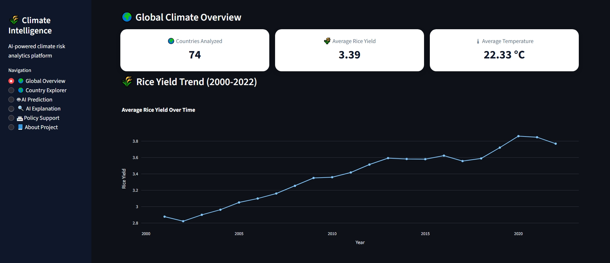
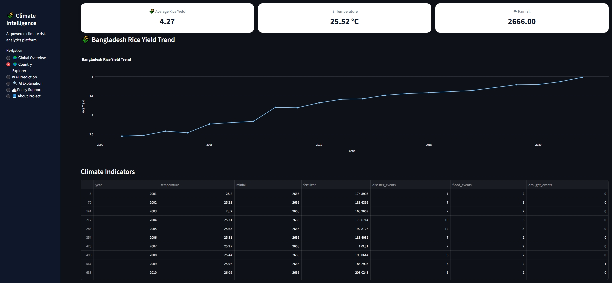
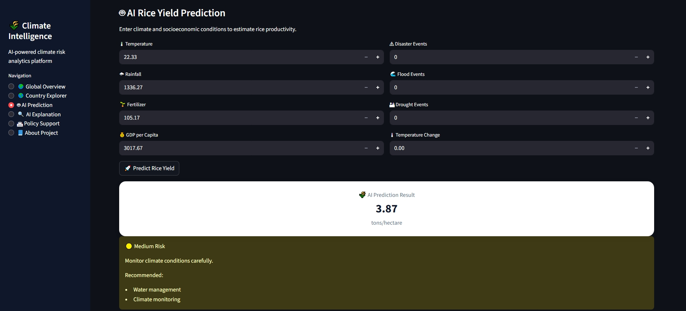
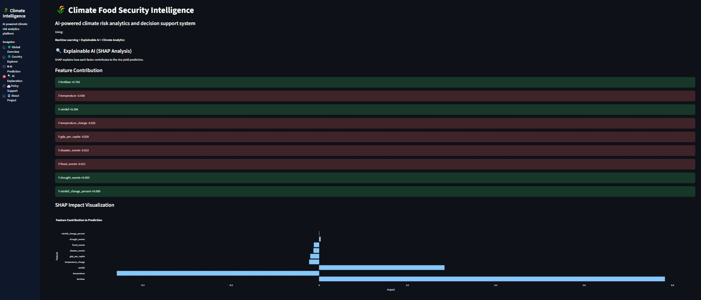
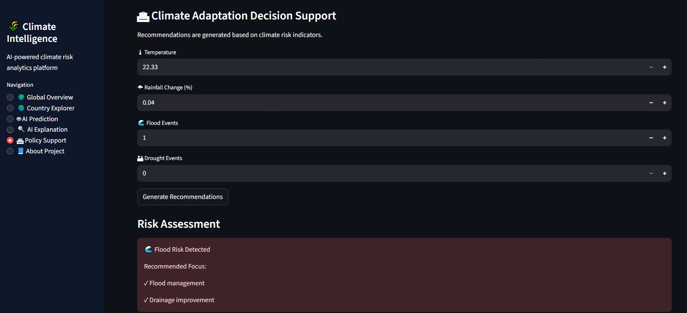

# AI-Based Climate Risk Analytics for Food Security

## Project Overview

An AI-powered climate risk analytics platform developed to predict rice
productivity and provide explainable climate adaptation insights using
Machine Learning, Explainable AI (SHAP), and decision-support analytics.

## 🚀 Live Demo

Try the interactive dashboard:

[Open Climate Food Security Dashboard]([YOUR_STREAMLIT_LINK](https://ai-climate-risk-food-security-bgeuqhth2hpdastsktd5hw.streamlit.app/)

## Key Features

-   Rice yield prediction using Machine Learning
-   Time-based model validation
-   SHAP Explainable AI analysis
-   Climate risk assessment
-   Policy decision support
-   Interactive Streamlit dashboard

## Project Workflow

Climate & Agricultural Data → Data Processing → Machine Learning →
Prediction → SHAP Explanation → Policy Decision Support

## Dashboard Preview

## Model Information

Algorithm: Random Forest Regression

Validation Strategy: Time-based split

Training Period: 2000-2019

Testing Period: 2020-2022

Metrics: - MAE - RMSE - R²

## Technologies

-   Python
-   Pandas
-   Scikit-learn
-   SHAP
-   Streamlit
-   Plotly

## Running the Project

Install dependencies:

pip install -r requirements.txt

Run dashboard:

streamlit run app.py

## Development Relevance

This project demonstrates how AI-based analytics can support climate
adaptation, food security analysis, and evidence-based decision support.
